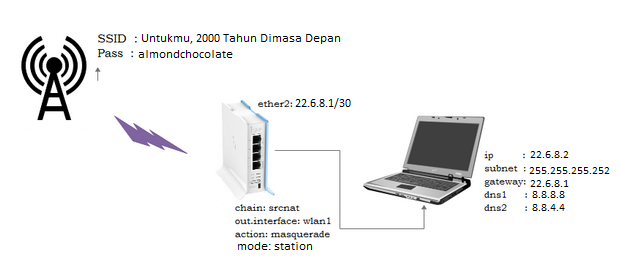
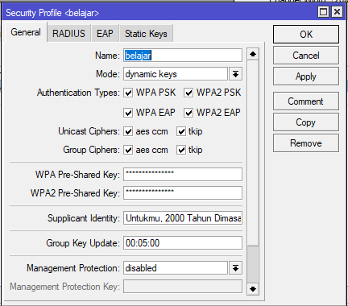
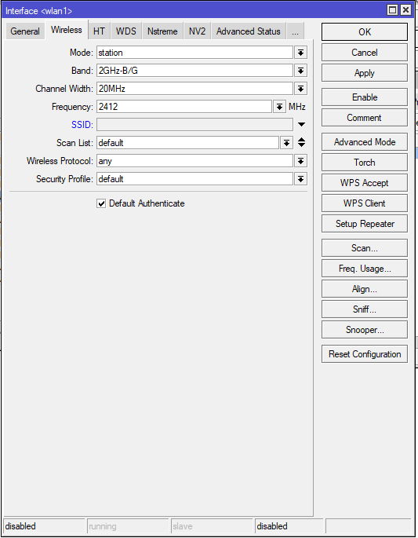
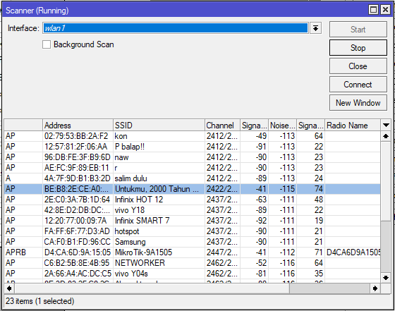
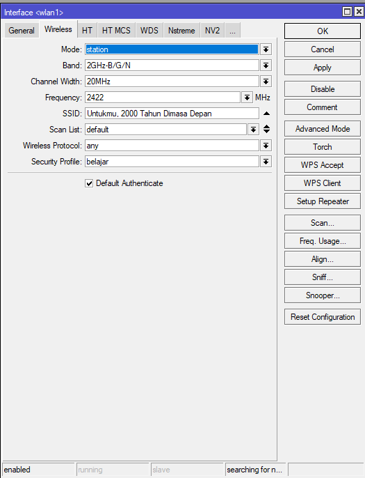
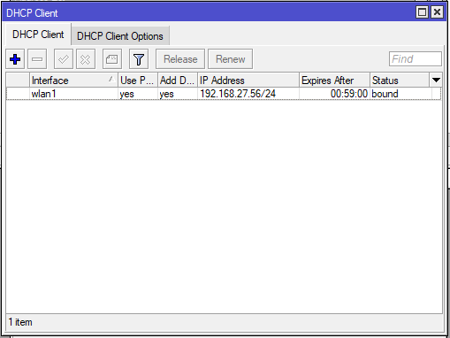
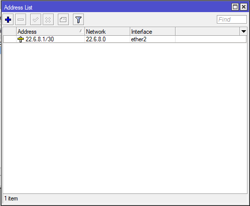
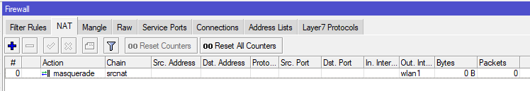
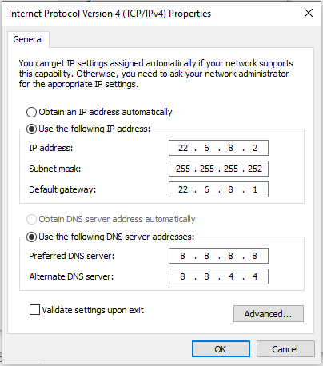
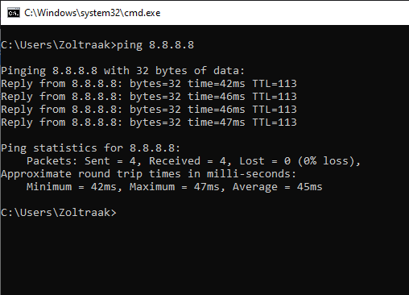

# LAB 6 Mengkoneksikan Mikrotik Sebagai Station ke Access Point
Selasa 12 Agustus 2025  

  Mikrotik sebagai Station adalah  

# Mengkoneksikan Mikrotik sebagai station ke access Point  

  1. Buat security Profilesnya, di **Wireless > Security Profiles** isi dengan,  
     name = belajar (bebas)  
     mode = dynamic keys  
     Authentication Types = checklist semua  
     Unicast Ciphers = checklist semua  
     Group chiphers = checklist semua  
     WPA Pre-shared key = almondchocolate (isi dengan passwd AP yang akan diakses)  
     WPA2 Pre-Shared key = almondchocolate (isi dengan passwd AP yang akan diakses)  
     Supplicant Identity = Untukmu, 2000 Tahun Dimasa Depan (isi dengan nama/SSID AP yang akan diakses)  
     Lalu Apply dan OK  
       
  2. Lalu aktifkan interface wlan jika interfacenya mati, **wireless > WiFi interface**  
     Klik interfacenya satu kali saja lalu tekan checklist (V) diatas untuk menyalakan. Jika sudah menyala, interfacenya tidak akan berwarna abu-abu.  
  3. Setelah itu double click interface wlan1 nya, pindah ke tab **wireless** lalu ganti modenya menjadi station,  
     **mode=station**
     
  5. Masih di window wireless, di sebelah kanan ada **scan**, masuk kesitu, lalu **start**  
       
  6. Cari AP yang akan di sambungkan dengan Router, klik 1 kali kalu klik connect. Jika sudah connect, nanti akan muncul SSID AP nya dibagian SSID  
       
  7. Tambahkan DHCP Client untuk wlan1. Pastikan statusnya bound.  
       
  8. Sekarang tambahkan IP Address untuk ether2, **IP > Addresses > +**  
     Interface=ether2  
     Address=22.6.8.1/30  
       
  9. Tambahkan firewall NAT.  
       
  10. Lalu, setting IP di Client.  
       
  11. Jika sudah, cek koneksi dengan ping di CMD.
          
